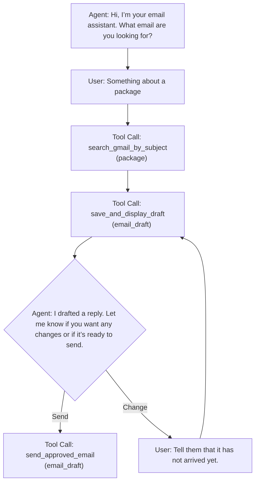

# Email Agent


## About

Email Agent is a Python CLI that helps users search for an email, draft a reply, revise that reply, and send it. The user describes what they are looking for in natural language, the agent retrieves the relevant email, and then composes a suggested response. The user can approve the draft, request changes, or send it.

## Key Features

- **Deterministic state control**: the model drafts, but the program owns what gets stored and sent; the draft shown to the user is always exactly what gets sent, never a fresh regeneration
- **Natural language search**: describe the email you're looking for in plain English; no query syntax required
- **Guided setup**: a first-run script validates prerequisites, prompts for credentials, and writes the .env so the agent is ready to use immediately
- **Placeholder guardrail**: outgoing emails are checked for signature placeholders like `[Your name]` before sending; if one is detected, the send is blocked and the model prompts the user to resolve it

## Summary

The core design challenge in an email agent is deciding what the model should control and what it shouldn't. This project draws a clear line: the LLM handles intent, search, and drafting while the program owns state, display, and sending. Drafts are saved to state the moment they're shown to the user, so the message that gets sent is always exactly what was reviewed and not a fresh model generation. That separation keeps the agent feeling fluid while making the high-stakes parts fully predictable.

## Setup Guide

### Prerequisites

Before getting started, make sure you have:

1. A `credentials.json` file from a Google Cloud project with Gmail API access
2. An OpenAI API key
3. Python installed
4. The project dependencies installed from `requirements.txt`

### Google Cloud Project Credentials

To access Gmail for searching and sending email, you need to create and authorize a Google Cloud project.

> [!TIP]
> The names of items are not significant and can be anything you choose.

1. Create a new [Google Cloud project](https://console.cloud.google.com/projectcreate)
2. Enable the Gmail API

   * Go to **APIs & Services** → **Enable APIs and Services**
   * Search for **Gmail API** and enable it
3. Initialize Auth

    * Go though [Project configuration]((https://console.cloud.google.com/auth/overview/create))
    * Select `External` project type

4. Set up Scopes

    * Go to [Data Access](https://console.cloud.google.com/auth/scopes)
    * Click `Add or remove scopes`
    * Scroll to bottom to `Manually add scopes`
    * Add: `https://mail.google.com/`
    * Click `Add to Table` then `Update`


5. Create OAuth Client [credentials](https://console.developers.google.com/auth/clients/create)

   * Choose **Desktop app** as the application type
   * Click `Download JSON` and download the credentials file

    > [!IMPORTANT]
    > Remember to move this file to the root folder of the project and to rename it `credentials.json`

6. Add test users

   * The app is in testing mode, every user must be added as a test user
   * In the [Audience](https://console.cloud.google.com/auth/audience) settings → Test users → add your email address that will use the app

### OpenAI API Key

Create an API key from the [OpenAI platform](https://platform.openai.com/api-keys) and keep it ready for first-time setup.

## Installation

1. Download the project.
2. Open a terminal in the project folder.
3. *Optional*: Create and activate a virtual environment.
4. Install the dependencies.

```bash

# GIT clone the repo
git clone https://github.com/BoratBorat10/Email_Response_Agent.git
cd Email_Response_Agent


# Create a virtual environment
python -m venv .venv

# Activate it
# macOS / Linux
source .venv/bin/activate

# Windows PowerShell
.\.venv\Scripts\Activate.ps1

# Install dependencies
pip install -r requirements.txt

# Run the agent
python agent.py
```

## First Run

When you run `agent.py` for the first time, a setup helper will guide you through the required configuration.

It will:

* Validate that `credentials.json` exists
* Prompt you for your OpenAI API key
* Prompt you for the name to use in the email signature
* Create and populate `.env` file

On the first run, a browser window will also open and prompt you to allow access to your Google account.

After setup is complete, the Agent is ready to use and will start.

## Technical Overview

### Tools

The model has access to three tools:

* `search_gmail_by_subject`
* `save_and_display_draft`
* `send_approved_email`

### `search_gmail_by_subject`

When the model decides it needs to search the inbox, it calls this tool and passes a query. The tool searches Gmail and returns a single parsed result.

Returned fields:

```python
return {
    "status": "success",
    "thread_id": thread_id,
    "message_id": message_id,
    "sender": sender,
    "recipient": recipient,
    "owner_email": owner_email,
    "date": date,
    "subject": subject,
    "body": body.strip()
}
```

This gives the agent the information it needs to reason about the message and prepare a reply.

### `save_and_display_draft`

Once an email has been retrieved, the model is instructed to immediately draft a reply and pass it to this tool, without asking the user first. The drafted email is saved into `state_current_draft`, and then shown to the user.

This tool serves two important purposes:

**1. It creates a reliable source of truth for the reply.**
Instead of asking the model to regenerate the draft later, the system stores the exact draft that was shown to the user. When the email is eventually sent, the content is taken from this saved state rather than from a fresh model response. This reduces indeterminism and ensures the user sees exactly what will be sent.

**2. It makes the draft easier to present in the CLI.**
Because the tool receives the email body directly, the draft can be rendered in a dedicated panel rather than appearing as plain conversational text.

### `send_approved_email`

Sending email is a high-stakes action, so this tool acts only as a trigger. It takes no arguments from the model. Once the model determines that the user wants to send the message, it calls this tool. A deterministic function then collects the required values from saved state and sends the reply.

```python
send_reply(
    service=gmail_service,
    to_address=state_fetched_email.get('sender'),
    subject=state_fetched_email.get('subject'),
    body_text=state_current_draft,
    thread_id=state_fetched_email.get('thread_id'),
    original_message_id=state_fetched_email.get('message_id')
)
```

This design ensures predictability. The recipient, subject, thread information, and message body all come from stored state rather than from a fresh model decision at send time. In other words, the message that is displayed to the user is exactly the message that gets sent.

## Main Agent Loop
Example flow:



At the end of each loop, the program only asks for user input if `requires_user_input == True`.

This allows multiple tool calls to happen back-to-back without interrupting the flow. For example, the agent can search for an email and then immediately generate and display a draft in the same turn.

User input is requested only after the model produces a message. If the model instead produces a function call, the program executes that function, appends the result to `conversation_history`, and loops again.

This creates a more natural interaction pattern and avoids unnecessary pauses between steps.

## Edge Cases and Design Decisions


### Replying in the Original Thread

Because the assignment was to build an email response agent, replies are sent in the original thread rather than as new standalone emails. This is done by storing the original `message_id` and attaching the appropriate reply headers.

```python
message['In-Reply-To'] = original_message_id
```

An additional fix was needed in the Gmail search query to exclude messages sent by the current user:

```python
q = f"subject:({subject_query}) -from:me in:inbox"
```

Without this filter, the search could return emails sent by the user, which would make replying nonsensical.

### Email Signature

One design question was how the system should know what name to use in the signature.

#### Option 1, Retrieve the user’s name from Google APIs

At first glance this seems natural, but the Gmail API does not directly return the user’s first and last name. Getting that information would require expanding the project to use the Google People API and broader scopes. I wanted to avoid adding more setup complexity.

#### Option 2, Infer the name from the Gmail address

The Gmail API does return the user’s email address:

```python
profile = service.users().getProfile(userId='me').execute()
owner_email = profile.get('emailAddress', '')
```

However, an email address does not always clearly reveal the user’s actual name.

#### Option 3, Let the model decide

More often than not, the model was able to determine an appropriate email signature from the context of the email without any user input. When it worked, this was the smoothest experience. However, it also had clear downsides. First, it was non-deterministic, and every so often it would fail in a strange way, either by inserting an irrelevant name in the signature or by falling back to a placeholder like `[Your name]`. Both of these failure modes were annoying because they required the user to prompt the model to fix the signature, assuming they noticed the problem in time and did not send the email as-is.

To guard against the catastrophic failure of sending an email with a `[Your name]` placeholder, the send function checks `has_signature_placeholder`. If it returns true, the tool call fails and an error description is appended to `conversation_history`:

```python
if has_signature_placeholder(state_current_draft):
    error_msg = '{"error": "Draft contains placeholder [Your name]. Ask user for signature name before sending."}'
    conversation_history.append({
        "type": "function_call_output",
        "call_id": item.call_id,
        "output": error_msg
    })
```

This prevents the email from being sent and allows the model to explain what happened to the user and ask them to correct the signature.

#### Option 4, Ask the user during setup

In the end, I chose the simplest and most reliable option: ask the user for their name during setup and store it in `.env`. I originally avoided this because it felt slightly cumbersome, but since the app already includes a first-run setup flow, adding one more prompt turned out to be straightforward and worth the reliability gain.


